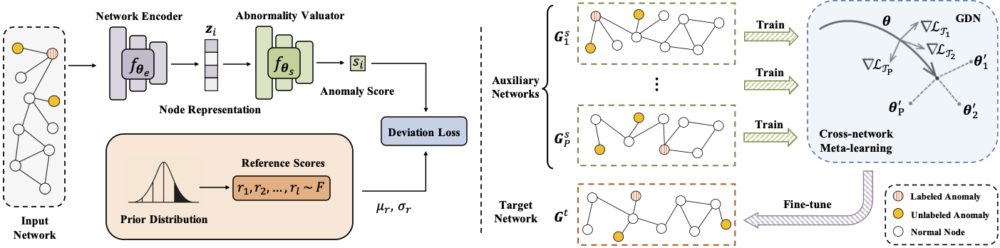

# Meta-GDN

This is the implementation for the paper: ["Few-shot Network Anomaly Detection via Cross-network Meta-learning"](https://arxiv.org/pdf/2102.11165.pdf).

# Requirements
-Python: 3.6  
-Pytorch: 1.1.0  
-numpy: 1.19.2  
-scikit-learn: 0.20.3  
-scipy: 1.2.1

# Evaluation
python evaluate.py
